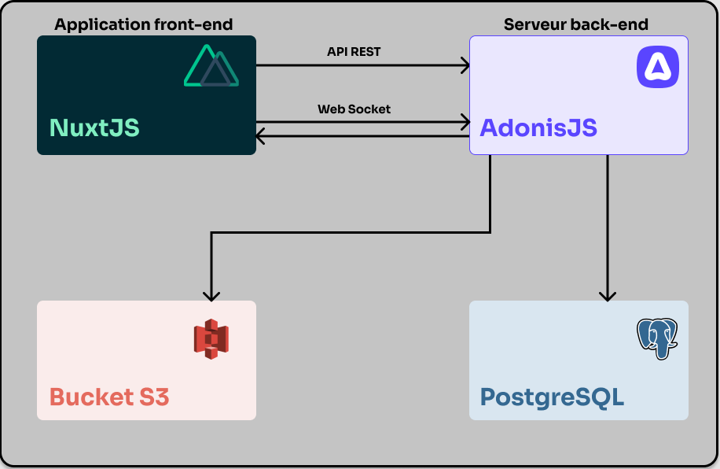
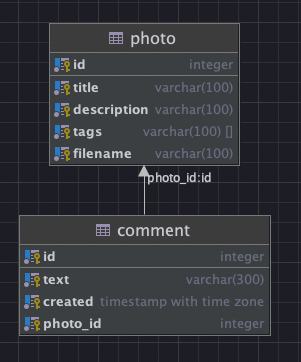
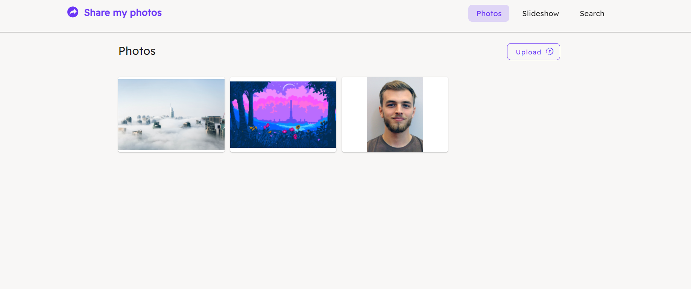
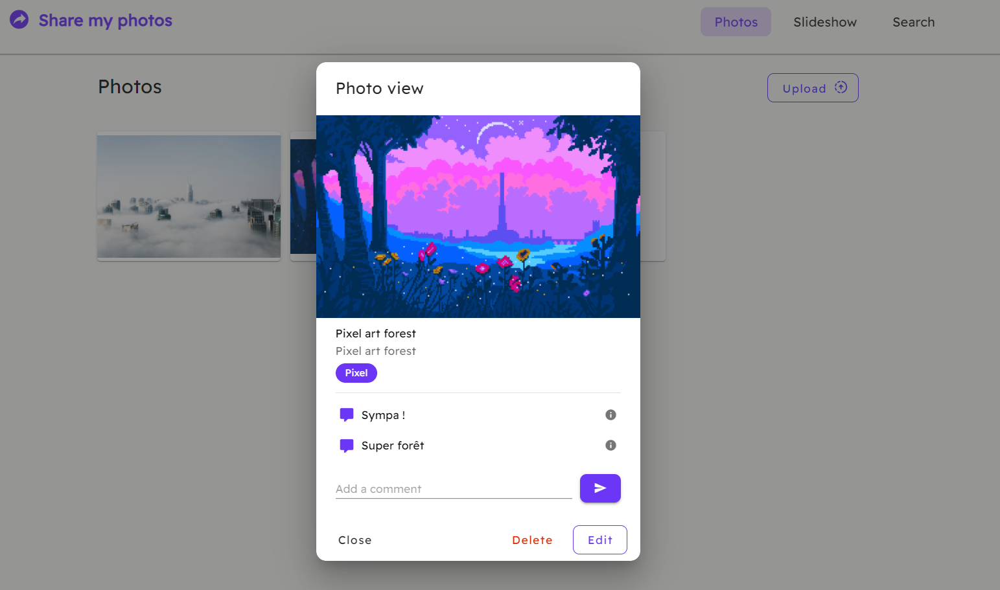
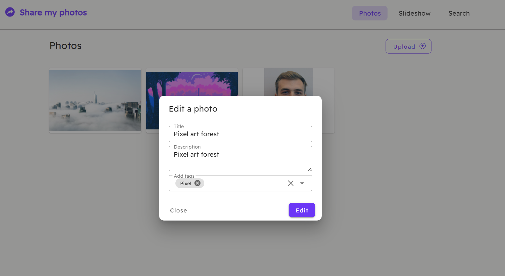
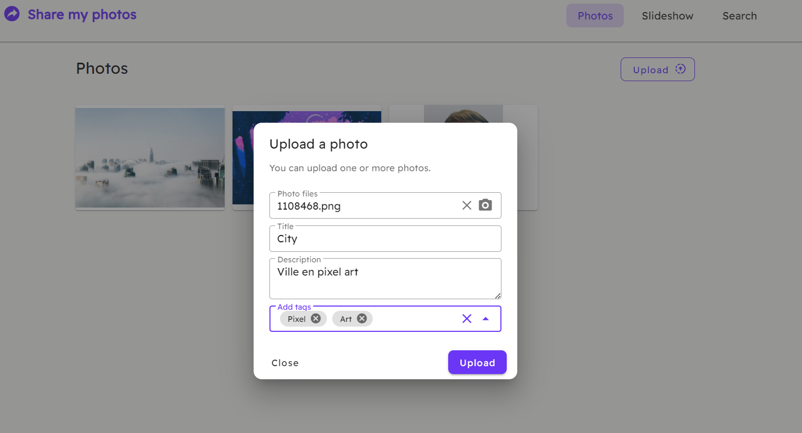
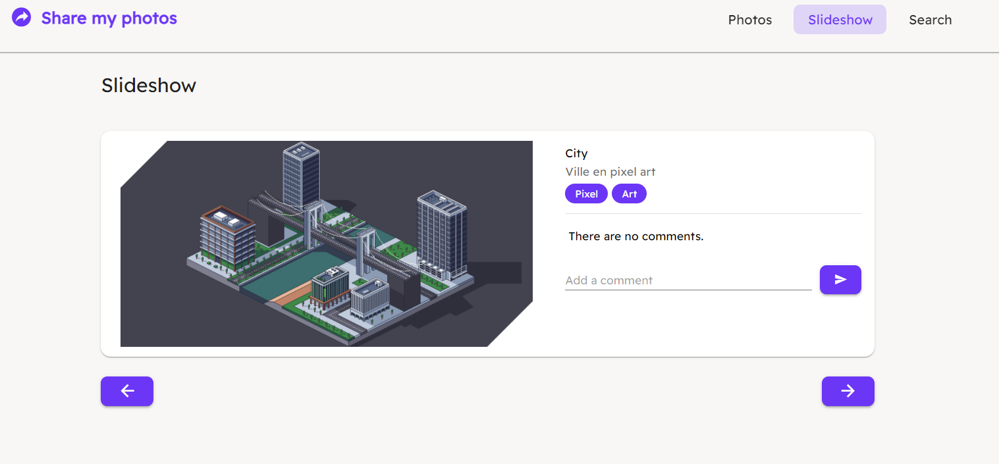
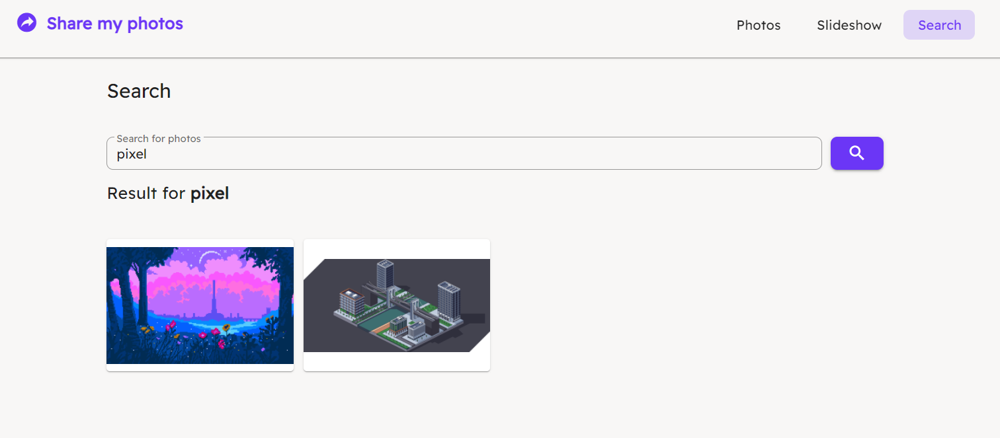

# Share my photos

## Sujet

Fonctionalités :

- Déposer, modifier et detruire des photos, chacune des photos étant associée à un commentaire
- Le dépôt doit pouvoir etre fait photo par photo ou par lot.
- Afficher les photos en mode diaporama
- Rechercher une photo particulière en fonction d’un commentaire
- Consulter les photos en mode syncronisé entre plusieurs clients connectés au meme
moment sur la meme url (si un des clients passe à la photo suivante, tous les autres clients
connecté voient aussi la photo suivante)

## Architecture

On passe par le serveur Client (frontend) avec localhost:3000 et on accède au serveru Serveur (backend) avec localhost:3333

Pour communiquer du frontend vers le backend, on utilise axios qui fait un proxy de localhost:3000/api vers localhost:3333

Les fichiers uploaded sont stockés par Adonis et sont dans le dossier tmp/uploads dans le projet Serveur.
C’est du stockage S3 en local.


## Schéma de la base de donnée



```sql
create schema app;

create table app.photo
(
    id          serial
        constraint photo_pk
            primary key,
    title       varchar(100),
    description varchar(100),
    tags        varchar(100)[],
    filename    varchar(100)
);

create table app.comment
(
    id       serial
        constraint comment_pk
            primary key,
    text     varchar(300),
    created  timestamp with time zone,
    photo_id integer not null
        constraint comment_photo_id_fk
            references app.photo
            on update cascade on delete cascade
);
```
## Vidéo
https://www.youtube.com/watch?v=kDt0upMi1Q4
## Captures






